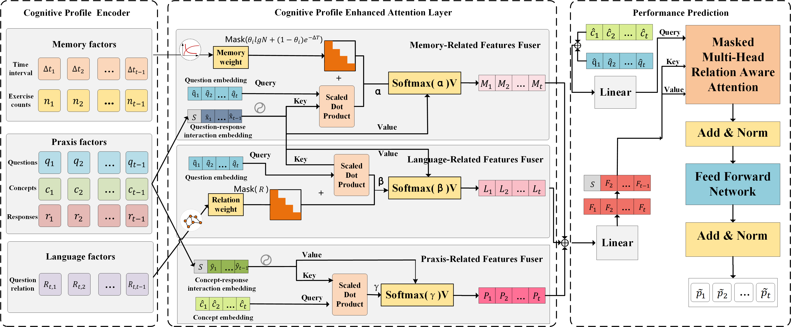

# CPKT: Cognitive Profiling Attentive Knowledge Tracing


## Setups
* Python 3.8.5
* Pytorch 1.4.0
* Numpy 1.17.4
* Scikit-learn 0.23.2
* TensorboardX 2.4

## Dataset
We also provide a data processing script to generate corresponding format data. The data and script are available [here](https://www.aliyundrive.com/s/SKentNYYpaz).  

## How to run model
If there are text materials in the datasets, e.g., eanalyst, poj, junyi:  
```python
python train_ykt.py --dataset eanalyst/poj/junyi --rel_pos  ……
```
otherwise,
```python
python train_ykt --dataset ednet --rel_pos --no_bert  ……
```

## Arguments
| Args       | Default | Help                                                         |
| ---------- | ------- | ------------------------------------------------------------ |
| dataset    | poj     | Dataset name                                                 |
| logdir     | runs/ykt| Save location of training log                                |
| savedir    | save/ykt| Save location of the trained model                           |
| embed_size | 60      | Size of embedding vectors                                    |
| rel_pos    | False   | Enable relation-aware self-attention layer                   |
| batch_size | 32      | Batch size                                                   |
| lr         | 1e-4    | Learning rate                                                |
| no_bert    | False   | Whether to use bert embedding                                |

## Contact
If you have any questions, please contact me on time. My E-mail is yt2542106000@mails.ccnu.edu.cn.
